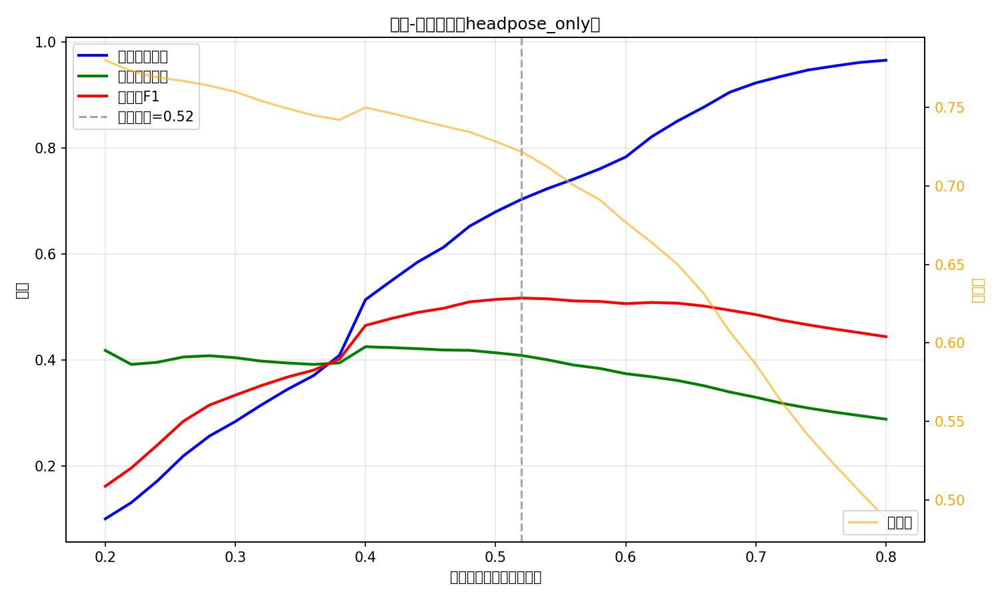

# 阈值-指标分析

## 模型

headpose_only (3维头部姿态，GRU hidden=128)，测试集30412样本

## 阈值扫描结果

| 阈值 | 不参与召回率 | 不参与精确率 | 不参与F1 | 准确率 |
|------|-------------|-------------|----------|--------|
| 0.30 | 28.40% | 40.43% | 0.3336 | 75.99% |
| 0.40 | 51.39% | 42.50% | 0.4653 | 75.00% |
| 0.50 | 67.97% | 41.36% | 0.5143 | 72.83% |
| 0.60 | 78.33% | 37.41% | 0.5064 | 67.68% |
| 0.70 | 92.31% | 32.96% | 0.4857 | 58.62% |

## 最优阈值

**0.52**：不参与F1最高（0.5169），召回率70.3%，精确率40.9%

## 应用建议

- 辅助教师初筛：用0.50，平衡漏报和误报
- 考试监考等强干预场景：用0.70+，宁可多抓不可漏
- 自动警告学生：当前模型任何阈值下误报率都过高，不建议使用

## 图片

